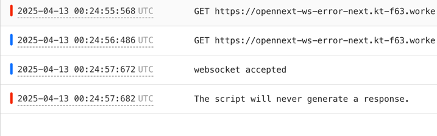

### reproduction
1. I create a websocket server DO worker follow the documentation `apps/do`.
2. I create a plain worker binding to the first worker. `apps/palin`
3. I followed the documentation of installing opennext and create `apps/next`.
4. connect to worker B(`apps/plain`) `wss://WORKER_B/api/ws`.  connect successfully and keep alive.
5. connect to Worker C(`apps/next`) `wss://WORKER_C/api/ws` which returning 1006 error and reporting "The script will never generate a response." Error in o11y dashboard.

### quick deploy

there are three worker in this repo, please deploy it separately

#### DO

#### Plain

#### Next
